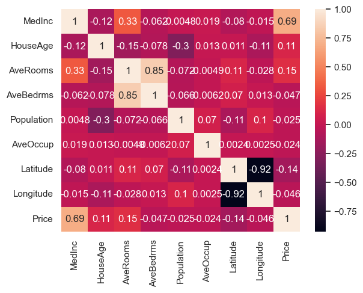
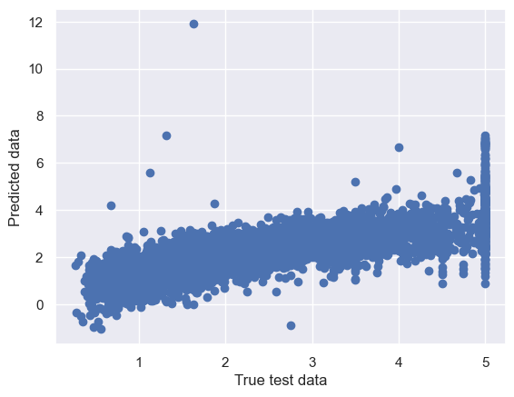

# California Housing Price Prediction — Multiple Linear Regression

Predict the **median house value** of California districts from 8 socio-economic and geographic
features, using a **Multiple Linear Regression** model built with scikit-learn.

This is a beginner-friendly, end-to-end machine-learning project that walks through the full
regression workflow: **load → explore → clean → scale → train → evaluate → save**.

---

## Dataset

The [California Housing dataset](https://scikit-learn.org/stable/datasets/real_world.html#california-housing-dataset)
ships with scikit-learn (`sklearn.datasets.fetch_california_housing`). It contains **20,640 districts**
with **8 numeric features** and one continuous target.

| Feature | Description |
|---|---|
| `MedInc` | Median income in the block group |
| `HouseAge` | Median house age in the block group |
| `AveRooms` | Average number of rooms per household |
| `AveBedrms` | Average number of bedrooms per household |
| `Population` | Block-group population |
| `AveOccup` | Average number of household members |
| `Latitude` | Block-group latitude |
| `Longitude` | Block-group longitude |
| **`Price`** *(target)* | Median house value (in $100,000s) |

---

## Workflow

1. Load the dataset and build a labelled pandas DataFrame
2. Inspect the data — dtypes, missing values, summary statistics
3. Correlation analysis with a heatmap
4. Separate features (`X`) from the target (`Y`)
5. Train/test split (67% / 33%)
6. Feature scaling with `StandardScaler` (fit on training data only)
7. Train a `LinearRegression` model
8. Evaluate with MSE, MAE, RMSE, R² and adjusted R²
9. Check assumptions (true vs. predicted plot)
10. Persist the fitted model with `pickle`

---

## Results

The model was evaluated on the held-out test set (6,812 districts):

| Metric | Score |
|---|---|
| R² | **0.594** |
| Adjusted R² | 0.593 |
| RMSE | 0.743 |
| MAE | 0.537 |
| MSE | 0.552 |
| Intercept | 2.063 |

> `MedInc` (median income) is the strongest predictor of price — its correlation with `Price` is **0.69**.

---

## Screenshots

**Correlation heatmap** — how each feature relates to the others and to `Price`:



**Actual vs. predicted** — points clustering along the diagonal indicate good predictions:



---

## Run it yourself

```bash
# 1. (optional) create a virtual environment
python -m venv .venv
# Windows:  .venv\Scripts\activate
# macOS/Linux:  source .venv/bin/activate

# 2. install dependencies
pip install -r requirements.txt

# 3. launch the notebook
jupyter notebook california_housing_price_prediction.ipynb
```

---

## Project structure

```
.
├── california_housing_price_prediction.ipynb   # main notebook (markdown-documented)
├── regressor.pkl                               # the trained, pickled model
├── images/                                      # plots used in this README
│   ├── correlation_heatmap.png
│   └── actual_vs_predicted.png
├── requirements.txt
└── README.md
```

---

## Tech stack

`Python` · `pandas` · `NumPy` · `matplotlib` · `seaborn` · `scikit-learn`

---

*A learning project exploring Multiple Linear Regression. Feedback and suggestions are welcome.*
